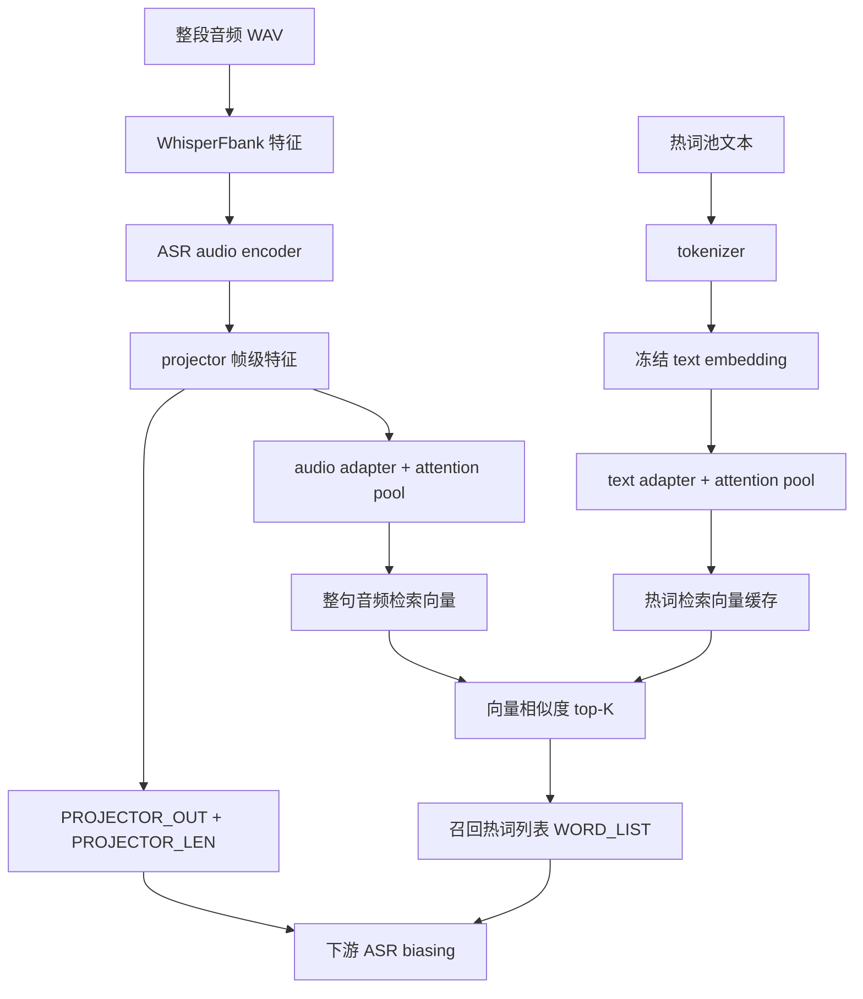

# RAG-ASR

双塔（audio-text）神经检索，用于 ASR 热词偏置。项目内置 Amphion / Qwen3 ASR 的 HuggingFace backend 代码，不依赖原始源码路径；训练数据、词池和部分权重仍依赖本机或共享盘路径。

## 热词召回流程



## 目录

```
RAG-ASR/
├── configs/               # 服务配置模板（复制为 serve.yaml 后按环境修改）
├── checkpoints/           # 基座 + adapter 权重说明；大权重可用软链接
├── docs/                  # 服务与项目组织文档
├── examples/              # 可运行示例、冒烟脚本与示例数据（见 examples/README.md）
├── evaluation/            # 数据集级离线评测与压测（见 evaluation/README.md）
├── tests/                 # 纯 pytest 单测（无网络、无本机服务依赖）
├── src/rag_asr/           # 可安装 Python 包
│   ├── backends/          # Amphion / Qwen3 HF 模型代码（内置）
│   ├── dual_tower.py      # 双塔、adapter、pooling、loss
│   ├── dataset.py         # Lhotse 数据集与特征 collate
│   ├── infer.py           # 离线批量检索与 recall 输出
│   ├── serve.py           # 在线服务核心 RAGASRRetriever
│   ├── model_loader.py    # backend 注册、基座和 adapter 加载
│   ├── vllm_bypass.py     # vLLM encoder bypass 协议与客户端
│   ├── train.py           # DDP 训练入口
│   └── eval_biasing.py    # biasing TSV 评测
├── scripts/               # shell 运维入口：训练、离线推理、服务启动、环境构建
└── triton/                # Triton model repository
    └── rag_asr_retrieve/
        ├── config.pbtxt
        └── 1/model.py     # Triton 模型版本 1
```

## 安装

```bash
cd RAG-ASR
pip install -e .
pip install -e ".[faiss]"   # 可选，加速 top-K
pip install -e ".[serve]"   # 可选，本地 HTTP 调试服务
```

默认配置使用 `examples/hotword_pool.txt` 作为可启动的示例热词库。部署到真实业务时，按实际路径修改 `configs/serve.yaml` 中的模型目录、词池和 Triton 执行环境。

## 新机器部署

新机器上需要先确认三类路径：项目内模型权重、外部数据盘、Triton 运行环境。服务部署只维护一个配置入口：`configs/serve.yaml`。项目内默认模型目录是 `checkpoints/base/amphion_1.7b_merged`，可用软链接指向真实权重；外部训练和评测数据不随仓库分发，需要通过环境变量传入。

最小服务启动流程：

```bash
cd RAG-ASR
pip install -e ".[serve]"

# 如果模型或热词库不在默认位置，先修改 configs/serve.yaml。
# 需要先准备官方 Triton server 本体；见 docs/SERVICE.md 的“安装官方 Triton server 本体”。

# 首次创建 Triton server 环境和 Python backend 执行环境。
bash scripts/build_envs.sh

# 注意：Triton Python backend 执行环境必须匹配 Triton Python backend stub。
# 默认 24.10-py3 使用 Python 3.10；不要指向已有的 server 启动环境。

# 按需修改 configs/serve.yaml 后启动。
bash scripts/start_triton.sh
```

离线推理或训练还需要设置外部数据根目录，例如 `RAG_ASR_DATA_ROOT=/path/to/DATA_ASR` 和 `RAG_ASR_HOTWORD_ROOT=/path/to/hotword`；目录结构不一致时用更细粒度的 `RAG_ASR_*_DIR` 变量覆盖。完整变量说明见 [docs/SCRIPTS.md](docs/SCRIPTS.md)，Triton 执行环境和 Python stub symlink 说明见 [docs/SERVICE.md](docs/SERVICE.md)。

## 最少入口

日常使用优先只看这 4 个入口：

- `bash scripts/start_triton.sh`：启动 Triton 在线服务，加载 `rag_asr_retrieve`。
- `python scripts/triton_hotword_client.py ...`：调用 Triton，负责热词库管理和单条音频检索。
- `bash scripts/infer.sh`：离线批量检索，用于数据集评测或生成 `hw_map`。
- `bash scripts/train_retrieval.sh`：训练双塔检索 adapter。

其他 `scripts/` 下的脚本主要用于环境构建、兼容入口或本地调试；可运行示例与冒烟脚本在 `examples/`，数据集级评测与压测在 `evaluation/`。脚本索引见 [docs/SCRIPTS.md](docs/SCRIPTS.md)，在线服务细节见 [docs/SERVICE.md](docs/SERVICE.md)。

## 在线服务

先启动 Triton：

```bash
bash scripts/start_triton.sh
```

然后用统一客户端管理热词库或检索音频：

```bash
bash scripts/hotword_status.sh
python scripts/triton_hotword_client.py --url localhost:8000 status
python scripts/triton_hotword_client.py --url localhost:8000 list --limit 20
python scripts/triton_hotword_client.py --url localhost:8000 import hotwords.txt
python scripts/triton_hotword_client.py --url localhost:8000 add 北京烤鸭 上海迪士尼
python scripts/triton_hotword_client.py --url localhost:8000 delete 北京烤鸭
python scripts/triton_hotword_client.py --url localhost:8000 infer --wav audio.wav --top-k 50
```

验证 vLLM encoder bypass 路径时，vLLM 需要以 `--enable-mm-embeds` 启动：

```bash
python examples/vllm_encoder_bypass.py \
  --vllm-url http://localhost:8009 \
  --triton-url localhost:8000 \
  --wav examples/audio/cv_zh_33411896.wav
```

常用参数语义：

- `--url`：Triton HTTP 地址，默认 `localhost:8000`。
- `status`：显示当前服务 live/ready 状态、模型 ready 状态、热词总量、样例热词和关键配置；`hotword_status.sh` 默认输出人类可读文本，加 `-j` 输出 JSON。
- `list --limit N`：最多显示 N 条已有热词，只控制查询结果分页大小，不影响热词库容量。
- `list --query TEXT`：按子串过滤已有热词，用于确认某个热词是否已入库。
- `list --offset N`：分页偏移量，和 `--limit` 配合浏览大词库。
- `import FILE`：从本地 txt/json 批量导入热词；服务端接收热词列表，不读取客户端文件路径。
- `add WORD...` / `delete WORD...`：从命令行批量增删热词，服务端会做规范化、去重和有效性过滤。
- `infer --wav FILE --top-k K`：对单条音频做检索，返回 `WORD_LIST`、`PROJECTOR_LEN` 和 `PROJECTOR_OUT` 形状；这里的 `--top-k` 是召回热词数量，和 `list --limit` 不同。

## 离线批量检索

```bash
bash scripts/infer.sh
```

离线结果可用 `rag-asr-merge-shards` 合并；`scripts/merge_hw_maps.py` 仅保留为兼容入口。

推荐模型目录（均在项目内）：

- 基座模型：`checkpoints/base/amphion_1.7b_merged`
- 热词 adapter：`checkpoints/base/amphion_1.7b_merged/hotword_adapter/best_adapter.pt`

显式 `adapter_ckpt` 仍可用于训练和实验；服务部署优先使用基座模型目录内的 `hotword_adapter`，避免 base model 与 adapter 版本错配。

## 训练

```bash
bash scripts/train_retrieval.sh
```

## Python API

```python
from rag_asr.infer import retrieve_neural

hw_map = retrieve_neural(
    items, [], top_k_max=50,
    adapter_ckpt="checkpoints/base/.../hotword_adapter/best_adapter.pt",
    base_model_path="checkpoints/base/amphion_1.7b_merged",
    hotword_pool_file="pool.txt",
)
```

## 说明

- **模型代码**：`backends/amphion` 与 `backends/qwen3` 已从原仓库复制，通过 `model_loader.register_backends()` 注册到 HuggingFace。
- **基座权重**（~4GB）：默认软链接到现有 checkpoint；见 `checkpoints/README.md` 改为本地拷贝。
- **评测数据 / 词池**：仍依赖外部数据盘路径，按本机环境在 `configs/serve.yaml` 中配置；仅模型与检索代码自包含。
- **Triton 目录**：`triton/rag_asr_retrieve/1/` 中的 `1` 是 Triton 标准模型版本目录，不是 Python 包层级。
- **运行产物**：`build/`、`*.egg-info/`、`exp/`、`_retrieve_cache/` 和 `var/` 都应视为本地生成物，不作为源码维护。

## 项目组织建议

当前仓库是“研究训练 + 离线检索 + 在线部署”一体项目。短期保持 `src/rag_asr/`、`scripts/`、`triton/` 三层即可；长期维护优先把服务路径集中到 `configs/serve.yaml`，再逐步把脚本按 `train`、`infer`、`serve`、`env` 分组，并将运行产物迁到 `var/`。
