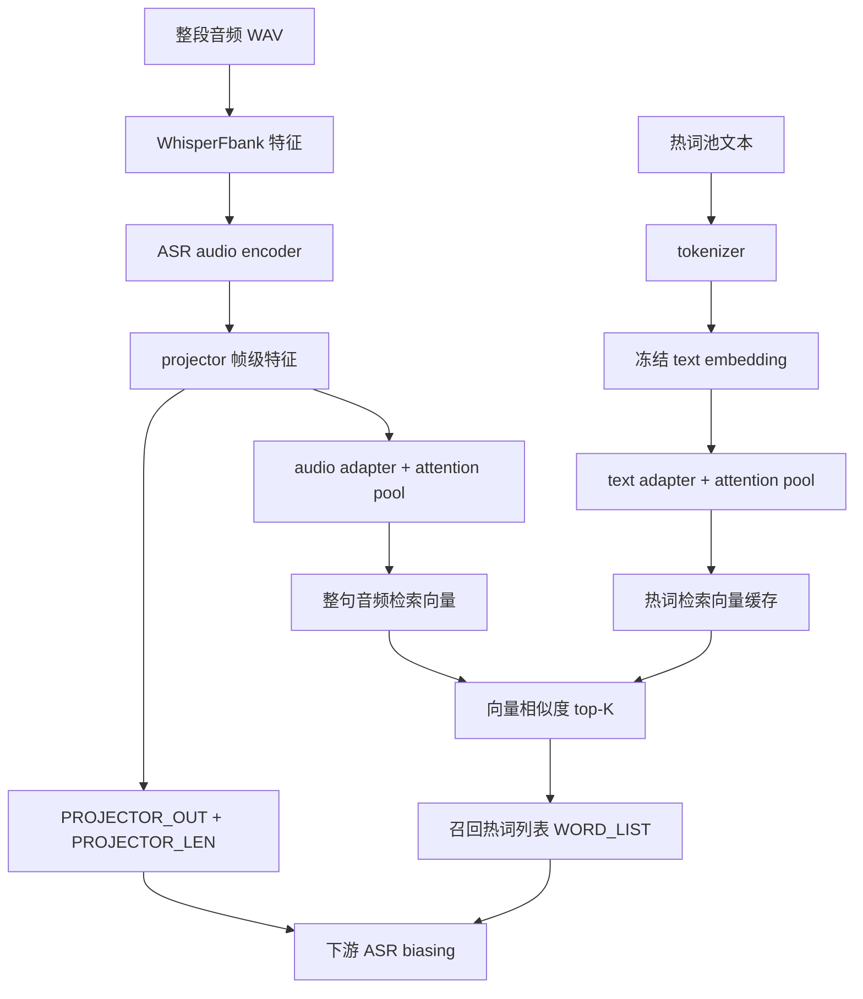

# RAG-ASR

双塔（audio-text）神经检索，用于 ASR 热词偏置。项目内置 Amphion / Qwen3 ASR 的 HuggingFace backend 代码，不依赖原始源码路径；训练数据、词池和部分权重仍依赖本机或共享盘路径。

## 热词召回流程



## 目录

```
RAG-ASR/
├── configs/               # 本机配置模板（复制为 serve.env 后按环境修改）
├── checkpoints/           # 基座 + adapter 权重说明；大权重可用软链接
├── docs/                  # 服务与项目组织文档
├── examples/              # Triton / HTTP 冒烟测试样例
├── src/rag_asr/           # 可安装 Python 包
│   ├── backends/          # Amphion / Qwen3 HF 模型代码（内置）
│   ├── dual_tower.py      # 双塔、adapter、pooling、loss
│   ├── dataset.py         # Lhotse 数据集与特征 collate
│   ├── infer.py           # 离线批量检索与 recall 输出
│   ├── serve.py           # 在线服务核心 RAGASRRetriever
│   ├── model_loader.py    # backend 注册、基座和 adapter 加载
│   ├── train.py           # DDP 训练入口
│   └── eval_biasing.py    # biasing TSV 评测
├── scripts/               # 训练、离线推理、服务启动和测试脚本
└── triton/                # Triton model repository
    └── rag_asr_retrieve/
        ├── config.pbtxt
        └── 1/model.py     # Triton 模型版本 1
```

## 安装

```bash
cd /chenmingjie/lx/RAG-ASR
pip install -e .
pip install -e ".[faiss]"   # 可选，加速 top-K
pip install -e ".[serve]"   # 可选，本地 HTTP 调试服务
```

如果要在新机器上部署，先复制 `configs/serve.env.example` 为 `configs/serve.env`，再按实际路径修改基座、adapter、词池和 Triton 执行环境。

## 推理

```bash
bash scripts/infer.sh
```

离线批量检索见 `scripts/infer.sh`；**在线服务**（Triton / HTTP）见 **[docs/SERVICE.md](docs/SERVICE.md)**。
多 GPU 分片结果可用 `rag-asr-merge-shards` 合并；`scripts/merge_hw_maps.py` 仍保留为兼容入口。

权重路径（均在项目内）：

- 基座：`checkpoints/base/amphion_1.7b_merged`
- Adapter：`checkpoints/adapters/amphion-1.7b_retrieval_v1.2/best_adapter.pt`

## 训练

```bash
bash scripts/train_retrieval.sh
```

## Python API

```python
from rag_asr.infer import retrieve_neural

hw_map = retrieve_neural(
    items, [], top_k_max=50,
    adapter_ckpt="checkpoints/adapters/.../best_adapter.pt",
    base_model_path="checkpoints/base/amphion_1.7b_merged",
    hotword_pool_file="pool.txt",
)
```

## 说明

- **模型代码**：`backends/amphion` 与 `backends/qwen3` 已从原仓库复制，通过 `model_loader.register_backends()` 注册到 HuggingFace。
- **基座权重**（~4GB）：默认软链接到现有 checkpoint；见 `checkpoints/README.md` 改为本地拷贝。
- **评测数据 / 词池**：仍在共享数据盘（`/chenmingjie/lx/data/hotword`、`/ai_sds_wuzz/...`），仅模型与检索代码自包含。
- **Triton 目录**：`triton/rag_asr_retrieve/1/` 中的 `1` 是 Triton 标准模型版本目录，不是 Python 包层级。
- **运行产物**：`build/`、`*.egg-info/`、`exp/`、`_retrieve_cache/` 和 `var/` 都应视为本地生成物，不作为源码维护。

## 项目组织建议

当前仓库是“研究训练 + 离线检索 + 在线部署”一体项目。短期保持 `src/rag_asr/`、`scripts/`、`triton/` 三层即可；后续若要长期维护，优先把本机路径集中到 `configs/serve.env`，再逐步把脚本按 `train`、`infer`、`serve`、`env` 分组，并将运行产物迁到 `var/`。
